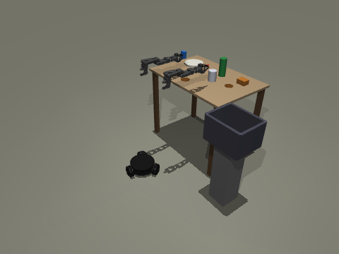
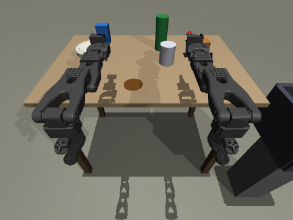
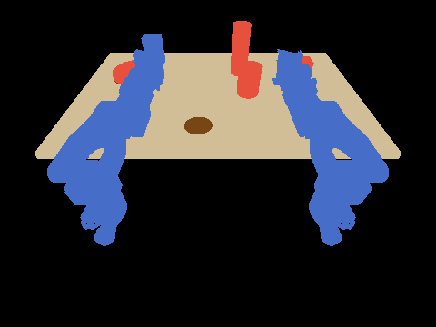

# TabulaSense

> カメラでテーブルの上を認識し、**片付け**と**拭き上げ**を自動で行う掃除ロボット
>
> A cleaning robot that sees the table with a camera and automatically **clears** it and **wipes** it down.


## 概要 / Overview

TabulaSense は、テーブルの上にある「片付けるべき物」と「拭き取るべき汚れ」をカメラで見分け、
アームで物を回収したあと、ワイパー／モップでテーブル表面を自動で拭き上げるロボットです。
また下げ膳なども行います。

> TabulaSense uses a camera to tell apart "things to clear away" and "stains to wipe off" on a table.
> It collects the items with its arms, then wipes the table surface with a wiper or mop.
> It also clears dishes from tables (bussing).

## 開発目標（MVP） / Development goals (MVP)

XLeRobotをMuJoCoでシミュレーションし、最新論文を実装して精度向上も目指す。
さらに、XLeRobotを自費で購入し組み立てる。そして顧客で試験導入しながら精度向上を目指す。
YORのシミュレーションモデルを作成し、YOR(https://yourownrobot.ai/)を助成金で購入しさらにPoCを行う。

全体の計画は [docs/roadmap.md](docs/roadmap.md) にあります。いまはフェーズ 0（シミュレーション環境）が終わったところです。

> Simulate XLeRobot in MuJoCo and improve accuracy by implementing recent research papers.
> Then buy and assemble an XLeRobot ourselves, and keep improving accuracy through pilot deployments with customers.
> Build a simulation model of YOR (https://yourownrobot.ai/), buy a YOR with grant funding, and run a further PoC.
>
> The full plan is in [docs/roadmap.md](docs/roadmap.md) (Japanese). Phase 0 (the simulation environment) is done.



## できること（現時点） / Current features

| 項目 / Item | 内容 / Description |
|---|---|
| シーン / Scene | XLeRobot（上流の MJCF をそのまま読み込む）＋テーブル＋食器 4 種＋汚れ＋下げ膳用ビン<br>XLeRobot (upstream MJCF loaded as is) + table + 4 kinds of tableware + stains + a bin for collected dishes |
| 拭き取り / Wiping | 右手にスポンジを持たせてある。スポンジが天板に触れながら動くと、触れた汚れが薄くなる<br>One hand holds a sponge. When the sponge moves while touching the table, the stains it touches fade |
| 環境 / Environment | Gymnasium 環境 `TabulaSense/TableClean-v0`（行動 15 次元、観測は真値）<br>Gymnasium environment `TabulaSense/TableClean-v0` (15-dim actions, ground-truth observations) |
| カメラ / Cameras | `head_cam`（実機の頭カメラ相当）、`top_cam`（真上）、`overview_cam`（全体）<br>`head_cam` (like the real robot's head camera), `top_cam` (top-down), `overview_cam` (whole scene) |
| 認識 / Perception | 真値から「物 / 汚れ / テーブル / ロボット」のラベル画像を作る（検出モデルの正解データ用）<br>Builds label images (item / stain / table / robot) from ground truth, as training and evaluation data for detection models |

| 頭カメラ / Head camera | ラベル画像（赤＝回収する物、茶＝汚れ） / Labels (red = item to collect, brown = stain) |
|---|---|
|  |  |

## ワンクリックで起動（Windows） / One-click launch (Windows)

フォルダの中の **`start-sim.bat` をダブルクリック**するとシミュレーションが開きます。
初回は仮想環境の作成・ライブラリのインストール・XLeRobot モデルの取得まで自動で行います（数分）。
デスクトップから起動したいときは、`start-sim.bat` を右クリック →「ショートカットの作成」で
できたショートカットをデスクトップに移してください。

> **Double-click `start-sim.bat`** in the folder to open the simulation.
> The first run automatically creates the virtual environment, installs the libraries and downloads the XLeRobot model (a few minutes).
> To launch from the desktop, right-click `start-sim.bat` → "Create shortcut" and move the shortcut to your desktop.

## セットアップ（自分の PC で動かす） / Setup (run on your own PC)

必要なもの: **Python 3.10 以上**と **Git**。動作確認は Python 3.11 / MuJoCo 3.14 で行いました。
GPU は不要です。

> Requirements: **Python 3.10+** and **Git**. Tested with Python 3.11 / MuJoCo 3.14. No GPU needed.

### Windows（PowerShell）

```powershell
git clone https://github.com/Ryotaro-Fujiwara-san/TabulaSense.git
cd TabulaSense
py -m venv .venv
.venv\Scripts\Activate.ps1          # エラーが出たら下の注を参照 / see the note below if this fails
pip install -e ".[dev]"
python scripts/fetch_xlerobot.py      # XLeRobot の MuJoCo モデルを取得（約 30MB） / download the XLeRobot model (~30MB)
pytest                                # 7 件のテスト / 7 tests
python scripts/view.py --demo         # ロボットが拭き掃除をする / the robot wipes the table
```

> 注: `Activate.ps1` が実行できないときは、一度だけ
> `Set-ExecutionPolicy -Scope CurrentUser RemoteSigned` を実行してください。
>
> Note: if `Activate.ps1` is blocked ("running scripts is disabled"), run
> `Set-ExecutionPolicy -Scope CurrentUser RemoteSigned` once.

### macOS / Linux

```bash
git clone https://github.com/Ryotaro-Fujiwara-san/TabulaSense.git
cd TabulaSense
python3 -m venv .venv && source .venv/bin/activate
pip install -e '.[dev]'
python scripts/fetch_xlerobot.py
pytest
python scripts/view.py --demo         # macOS では mjpython / use mjpython on macOS
```

### 画面のないサーバー（クラウド、Docker、CI） / Headless servers (cloud, Docker, CI)

画像を描画するには OpenGL を用意して `MUJOCO_GL` を指定します。

> To render images, install OpenGL and set `MUJOCO_GL`.

```bash
sudo apt-get install -y libegl1 libosmesa6   # Ubuntu / Debian
export MUJOCO_GL=egl                         # GPU があれば egl、なければ osmesa / egl with a GPU, osmesa without
```

## 動かしてみる / Try it

```bash
# 3 台のカメラ画像とラベル画像を outputs/scene/ に保存
# Save the three camera images and the label image to outputs/scene/
python scripts/render_scene.py --seed 0

# スポンジで汚れを拭き取る手書きデモ（動画保存には pip install imageio imageio-ffmpeg）
# Hand-written wiping demo (pip install imageio imageio-ffmpeg to save the video)
python scripts/demo_wipe.py --video outputs/demo_wipe.mp4
```

```python
import gymnasium as gym
import tabulasense  # 環境の登録 / registers the environment

env = gym.make("TabulaSense/TableClean-v0", render_mode="rgb_array")
obs, info = env.reset(seed=0)
obs, reward, terminated, truncated, info = env.step(env.action_space.sample())
print(info)  # {'objects_on_table': 4, 'objects_in_bin': 0, 'objects_dropped': 0, 'dirt_remaining': 3.0}
```

ウィンドウで見るときは `python scripts/view.py`（マウスで視点を回せます）。
自分のコードからは `render_mode="human"` を指定します。

> To watch in a window, run `python scripts/view.py` (drag with the mouse to rotate the view).
> From your own code, pass `render_mode="human"`.

### 行動と観測 / Actions and observations

- 行動（15 次元、すべて -1〜1） / Actions (15 dims, all in -1 to 1)
  - 0〜2: 台車の速度（ロボットから見て 前・左・旋回） / base velocity (forward, left, turn, in the robot frame)
  - 3〜8: 右腕 6 関節の目標角の増分（1 ステップ最大 0.05 rad） / target-angle increments for the 6 joints of arm `_R` (max 0.05 rad per step)
  - 9〜14: 左腕 6 関節の目標角の増分 / target-angle increments for the 6 joints of arm `_L`
  - 制御は 20Hz（物理は 500Hz） / control at 20 Hz (physics at 500 Hz)
- 観測（辞書） / Observations (dict)
  - `robot`: 腕の角度・角速度、台車の位置・向き・速度（30 次元） / arm joint angles and velocities, base position, heading and velocity (30 dims)
  - `objects`: 物体ごとの位置と [テーブル上, ビン内, 落下] フラグ / per-item position and [on table, in bin, dropped] flags
  - `stains`: 汚れごとの位置・半径・残り具合（0〜1） / per-stain position, radius and remaining dirt (0 to 1)
- 報酬: ビンに入れた物 +1、落とした物 −0.5、拭き取った量に比例して加点、全部片付いて拭き終えたら +5
  - Reward: +1 per item put in the bin, −0.5 per item dropped, a bonus proportional to the dirt wiped, +5 when everything is cleared and wiped

関節名の `_R` / `_L` は上流モデルの名前をそのまま使っています。スポンジは `_R` 側の手に付いています。

> Joint names `_R` / `_L` are kept from the upstream model. The sponge is attached to the `_R` hand.

## 上流モデルへの調整 / Changes to the upstream model

`third_party/` の XLeRobot のファイルは書き換えず、読み込んだあとに `sim/scene.py` で次の点を直しています。

> The XLeRobot files in `third_party/` are not edited. After loading them, `sim/scene.py` changes the following:

- 台車を表す箱が既定の密度から約 120kg になっていたので、8kg にした（`SceneConfig.cart_mass`）
  - The box representing the cart weighed about 120 kg (from the default density); it is now 8 kg (`SceneConfig.cart_mass`)
- オムニホイールが普通の車輪として床と接触し、横移動を妨げていたので、見た目だけにした
  - The omni wheels touched the floor like ordinary wheels and blocked sideways motion, so they are now visual only
- 台車の速度制御のゲインを上げた（kv=10 → 300）
  - Raised the base velocity-control gain (kv=10 → 300)
- 頭の 2 関節に駆動がなく重力で垂れていたので、位置制御を足した（`env.set_head_pose()`）
  - The two head joints had no actuators and sagged under gravity, so position control was added (`env.set_head_pose()`)

## 開発の進め方 / How to develop

