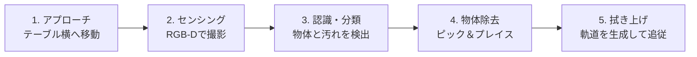

# TabulaSense

> カメラでテーブルの上を認識し、**片付け**と**拭き上げ**を自動で行う掃除ロボット

## 概要

TabulaSense は、テーブルの上にある「片付けるべき物」と「拭き取るべき汚れ」をカメラで見分け、
アームで物を回収したあと、ワイパー／モップでテーブル表面を自動で拭き上げるロボットです。

## 開発目標（MVP）

**3D仮想空間（シミュレーション）で、次の一連の動作を完全自動で実行できること。**

| # | ステップ | 内容 |
|---|---|---|
| 1 | **アプローチ** | ロボットがテーブルの横まで移動して停止する |
| 2 | **センシング** | アーム先端（または本体）の RGB-D カメラでテーブル表面を撮影する |
| 3 | **認識・分類** | 「片付けるべき物体」と「拭き取るべき汚れ」を見分ける（下表） |
| 4 | **物体除去** | アーム（ハンド）で物体を掴み、回収箱へ運ぶ |
| 5 | **拭き上げ** | ワイパーツール（または拭き取り用アタッチメント）に切り替え、汚れ領域全体をカバーする軌道で拭き取る |

### 認識する対象

| 種類 | 例 | 出力 |
|---|---|---|
| 片付けるべき物体 | ペットボトル、コップ など | 物体の位置（3D座標） |
| 拭き取るべき汚れ | 液体のこぼれ、粉じん など | 汚れの領域（ポリゴン） |

## 技術スタック

| 分類 | 使用技術 |
|---|---|
| シミュレーション | （未定） |
| ロボット制御 | （未定） |
| 物体・汚れ認識 | （未定） |
| 言語 | （未定） |

## ロードマップ

- [ ] シミュレーション環境の構築（ロボット・テーブル・カメラ）
- [ ] 1. テーブルへのアプローチ
- [ ] 2. RGB-D カメラでの撮影
- [ ] 3. 物体・汚れの認識
- [ ] 4. ピック＆プレイス
- [ ] 5. 拭き上げ軌道の生成と追従
- [ ] 1〜5 の一連動作を完全自動で実行（MVP 達成）
